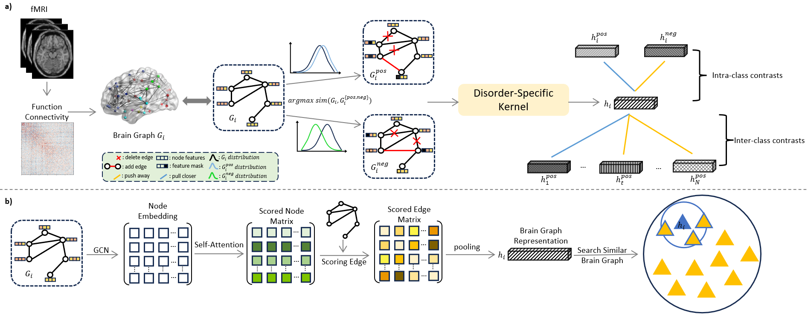

# Cf_BCL: Counterfactual-based Brain Graph Contrastive Learning Framework
The Implement of "Counterfactual Data Augmentation Guided Brain Graph Contrastive Learning for Neurological Biomarkers Analysis"

# Introduction
 we propose a novel brain graph contrastive learning framework with an interpretable learning kernel for brain disorders. Specifically, we design a counterfactual data augmentation mechanism to generate meaningful brain graphs. Moreover, a new contrastive loss with intra and inter-class contrasts is introduced to enhance brain graph learning ability. Besides, we propose a brain graph learning kernel to highlight important brain regions for discovering neurological biomarkers. Disorder prediction and biomarker analysis experiments on three real-world brain disorder datasets demonstrate the effectiveness of our method.

 # Framework

