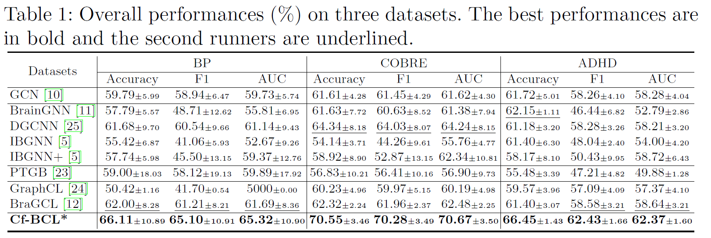

# Cf_BCL: Counterfactual-based Brain Graph Contrastive Learning Framework
The Implement of "Counterfactual Data Augmentation Guided Brain Graph Contrastive Learning for Neurological Biomarkers Analysis"

# Introduction
 we propose a novel brain graph contrastive learning framework with an interpretable learning kernel for brain disorders. Specifically, we design a counterfactual data augmentation mechanism to generate meaningful brain graphs. Moreover, a new contrastive loss with intra and inter-class contrasts is introduced to enhance brain graph learning ability. Besides, we propose a brain graph learning kernel to highlight important brain regions for discovering neurological biomarkers. Disorder prediction and biomarker analysis experiments on three real-world brain disorder datasets demonstrate the effectiveness of our method.

 # Framework

Given the fMRI data, preprocessing fMRI data and constructing brain graph first. After that, counterfactual brain data augmentation to generate meaningful positive and hard negative brain graphs. Before optimizing by intra and inter-class loss, the interpretation learning kernel extracts the discriminate features and structures, as well as, searching similar brain graphs that contain similar semantic relationships. 

# Experiments
## Dataset
In this project, three datasets have been evaluated, including `BP`, `COBRE` and `ADHD`.
- **BP** is a private dataset that can not be accessed without authorization.
- **COBRE** is a public dataset that could be downloaded from <a href="https://fcon_1000.projects.nitrc.org/indi/retro/cobre.html">[FCON_1000]</a>
- **ADHD** is a public dataset that could be downloaded from <a href="https://fcon_1000.projects.nitrc.org/indi/adhd200/">[FCON_1000]</a>

## Disorder Prediction
The proposed method(Cf_BCL) outperforms all baseline methods on three datasets.


## Neurological Biomarkers Analysis
Visualizing salient brain regions and connections for ADHD brain disorders.


# Run
To run our model on any of the datasets in our paper, simply run:
```
python main.py --dataset =<dataset name>
```
`--dataset` is the name of the dataset(`BP` is a private dataset, `COBRE` and `ADHD` are public datasets that could be used for everyone), the functional connectivity generated from fMRI should be located in the `data/` folder
